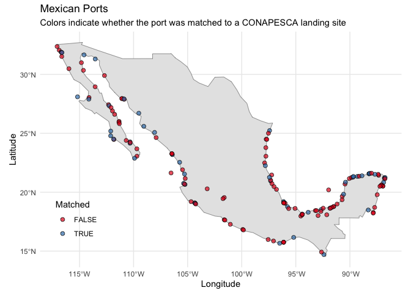

<!-- README.md is generated from README.Rmd. Please edit that file -->

# A geospatial dataset of Mexican ports

By: Emma Zgonena, Renato Molina & Juan Carlos Villaseñor-Derbez

Cite as: Zgonena et al., 2025. A geospatial dataset of Mexican ports.
DOI:
[10.5281/zenodo.15778574](https://zenodo.org/records/15778575#:~:text=10.5281/zenodo.15778574)

<!-- -->

## About

This repository is still in development. It will contain data and code
to a geospatial dataset of the major ports of Mexico. It is intended to
interface with other data in
[mex_fisheries](https://github.com/jcvdav/mex_fisheries), such as
vessel- and port-level landings information.

There are 152 ports in the final data. Lake ports, ports without a
matching port in both files, and repeats are filtered out in
`03_combine_sources.R`. 155 individual ports are identified in
`mexican_ports.csv`, 4 of which are on lakes and therefore are not
coastline ports. 51 of the total ports in `mexican_ports.csv` can be
matched to ports in `mex_large_scale_landing_ports.csv` by landing site
id, which is reflected in `mex_ports_dictionary.csv`. The ports that do
not have a correlated landing site id will show NA in that column.

### How the data are built

The final data, mex_ports, is a culmination of information from the
files `mexian_ports.csv` and `mex_large_scale_landing_ports.csv` that
are correlated through `mex_ports_dictionary.csv`.

The information in `mexican_ports.csv` is obtained from the pdf titled
`catastro.pdf`, which contains information on Mexican ports from the
Mexican Secretaria de Comunicaciones y Transportes and the Departamento
de Catastro, Instalaciones y Recintos. This information was extracted
through copying and pasting it and later reorganized into new columns.

- The inputs for `port_id` are labeled as ‘Clv. del puerto’ in
  `catastro.pdf`
- The inputs for `municipality_code` (renamed `municipality_id` in final
  `mex_ports` cleaned data) and `municipality_name` are found labeled
  together under ‘Municipio’ in `catastro.pdf`
- The inputs for `port_name` are labeled as `Nombre del Puerto` in
  catastro.pdf
- The inputs for `longitude` and `latitude` are labeled as `Longitud`
  and `Latutid` respectively in `catastro.pdf`

The information in `mex_large_scale_landing_ports.csv` is from Mexico’s
fisheries production data and was also extracted through copy and
pasting.

Overlaps of ports in these two files were identified through the file
`mex_ports_dictionary.csv` This file relates the ports that contained
the same or very similar names (ex, a port in one data set omitted
accents while the other did not).

The final data, `mex_ports`, was created using the script titled
`03_combine_sources.R`.

This script cleans and retains relevant columns from the dictionary,
omitting lake ports 4 that are not relevant to the set. It then combines
the objects through their corresponding `landing_site_key`. Finally, the
data is standardized in name and made further accessible through the
addition of tabular and geospatial file versions.

### Column specifications

- `municipality_id` or `municipality_code`: character. 5-digit code that
  acts as a unique identifier for each municipality.
- `municipality_name`: character. Official name of municipality.
- `port_id`: character. 5-digit code that acts as a unique identifier
  for each port.
- `port_name`: character. Official name of port. Originally labeled
  under ‘Nombre del Puerto’.
- `landing_site_id`: character. 3-digit alphanumeric string that acts as
  a unique identifier for a what CONAPESCA considers a landing site.

### Using the data
