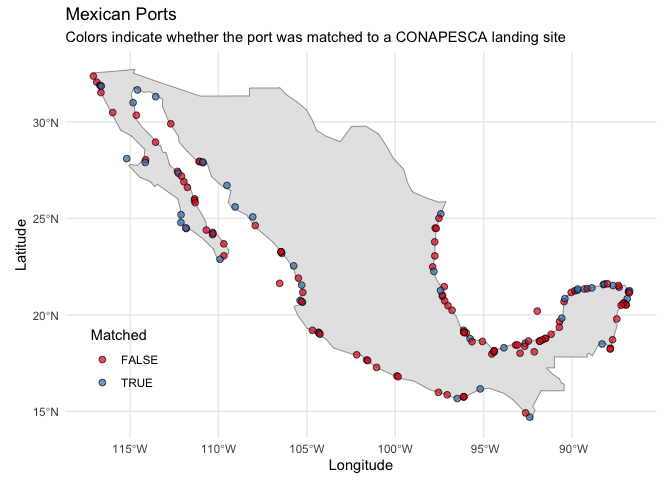

<!-- README.md is generated from README.Rmd. Please edit that file -->

# A geospatial dataset of Mexican ports

By: Emma Zgonena, Renato Molina & Juan Carlos Villaseñor-Derbez

Cite as: Zgonena et al., 2025. A geospatial dataset of Mexican ports.
DOI:
[10.5281/zenodo.15778574](https://zenodo.org/records/15778575#:~:text=10.5281/zenodo.15778574)

<!-- -->

## About

This repository is still in development. It will contain data and code
to a geospatial dataset of the major ports of Mexico. It is intended to
interface with other data in
[mex_fisheries](https://github.com/jcvdav/mex_fisheries), such as
vessel- and port-level landings information.

154 individual ports are identified in mexican_ports.csv, 4 of which are
on lakes and therefore are NOT coastline ports. 51 of the total ports in
mexican_ports.csv can be matched to ports in
mex_large_scale_landing_ports.csv, which is reflected in the
mex_ports_dictionary.csv file. 17 ports found in
mex_large_scale_landing_ports.csv cannot be accurately matched to
mexican_ports.csv obtained from catastro.pdf.

### How the data are built

The information in mexican_ports.csv is obtained from a file in the
folders ‘data’ -\> ‘raw’ titled catastro.pdf. catastro.pdf contains
information on Mexico ports from the Mexican Secretaria de
Comunicaciones y Transportes and the Departamento de Catastro,
Instalaciones y Recintos. This information was extracted by copying and
pasting it, and later reorganized into new columns. The information in
mex_large_scale_landing_ports.csv is from Mexico’s fisheries production
data and was extracted through copy and pasting.

The inputs for ‘port_id’ are labeled as ‘Clv. del puerto’ in
catastro.pdf. The inputs for ‘municipality_code’ (renamed
‘municipality_id’ in final mex_ports cleaned data) and
‘municipality_name’ are found labeled together under ‘Municipio’ in
catastro.pdf The inputs for ‘port_name’ are labeled as ‘Nombre del
Puerto’ in catastro.pdf The inputs for ‘longitude’ and ‘latitude’ are
labeled as ‘Longitud’ and ‘Latutid’ respectively in catastro.pdf

The inputs for ‘landing_site_id’ are originally labeled as \_\_\_ in
\_\_\_

mex_ports_dictionary.csv was created to find the overlap of ports
between these two files. This file connected the ports that contained
the same or very similar names (ex, a port in one data set omitted
accents while the other did not).

### Column specifications

- municipality_id: numeric. 5-digit numeric code that acts as a unique
  identifier for each municipality.
- municipality_name: text. Official name of municipality.
- port_id: numeric. 5-digit numeric code that acts as a unique
  identifier for each port.
- port_name: text. Official name of port. Originally labeled under
  ‘Nombre del Puerto’.
- landing_site_id: \_\_\_\_

### Using the data
